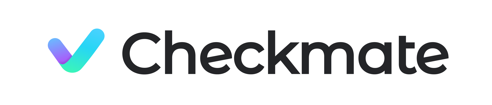
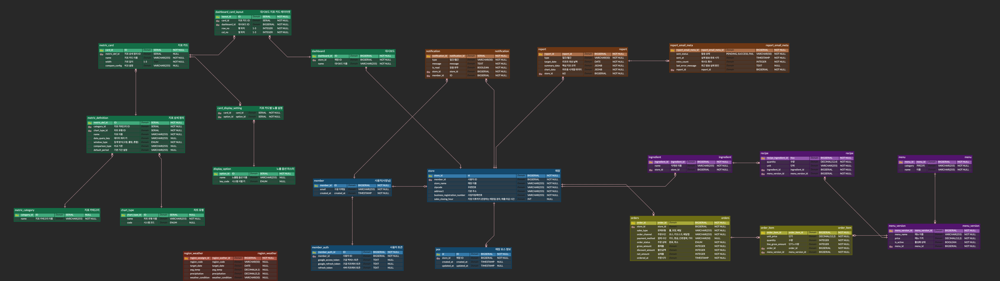

**HMG Softeer Bootcamp 7th - Team3**

**초보 외식업 사장님을 위한 실시간 매장 운영 관리 서비스**

---

## 💡 프로젝트 소개

### 🚀 프로젝트 배경
현재 많은 자영업자들이 비효율적인 운영과 급변하는 시장 환경 속에서 어려움을 겪고 있습니다. 특히 창업 아이템의 수명은 갈수록 짧아지고 있으며, 성공적인 매장 운영을 위한 명확한 기준과 데이터 활용의 필요성이 그 어느 때보다 높아지고 있습니다.

### ⚠️ 문제 정의
저희는 초보 사장님들이 겪는 **폐업 위기의 핵심 원인**을 네 가지로 정의했습니다.
1. **경험 부족:** 매장 운영에 대한 체계적인 노하우 부재
2. **불명확한 타겟:** 데이터에 기반하지 않은 막연한 고객 타겟팅
3. **비효율적인 운영:** 체계적이지 못한 운영 관리 시스템
4. **데이터 활용 부재:** 매장에서 발생하는 데이터를 분석하고 활용하는 능력 부족

### ✨ 주요 기능

- 맞춤형 매장 관리 대시보드
  * 매장의 매출 현황 및 주요 지표를 실시간으로 시각화하여 제공합니다.
  * 사장님이 한눈에 매장의 상태를 파악할 수 있는 직관적인 UI/UX를 지향합니다.

- 데일리 리포트
  * 매일 아침, 전날의 성과와 오늘의 핵심 할 일을 정리하여 제공합니다.
  * 복잡한 데이터 분석 없이도 당일 운영 방향을 설정할 수 있도록 돕습니다.

- AI 기반 질의응답
  * 매장 운영 중 발생하는 궁금증을 AI에게 즉시 질문하고 답변을 얻을 수 있습니다.
  * 데이터 기반 분석을 통해 사장님께 최적화된 인사이트를 제공합니다.

---

 

## 💡 시스템 구성도

### 🏗️ 전체 시스템 흐름도

 

### 🧩 시스템 아키텍처

 

### 🗂️ ERD

 

## 🛠️ 기술스택

|     구분     |                                                                                                                                                                                                                                                                                                                                                                                                                                                                                                                                                                                  Skills                                                                                                                                                                                                                                                                                                                                                                                                                                                                                                                                                                                  |
|:----------:|:------------------------------------------------------------------------------------------------------------------------------------------------------------------------------------------------------------------------------------------------------------------------------------------------------------------------------------------------------------------------------------------------------------------------------------------------------------------------------------------------------------------------------------------------------------------------------------------------------------------------------------------------------------------------------------------------------------------------------------------------------------------------------------------------------------------------------------------------------------------------------------------------------------------------------------------------------------------------------------------------------------------------------------------------------------------------------------------------------------------------------------------------------------------------:|
|   **FE** |               |
|   **BE** |                                                                                                                                                                                                                                                                                                                                                                                                                                                                                                                                                                                                                                                                                                                                                   |
| **Infra** |                                                                                                                                                                                                                                                                                                                                                                                                                                                                                                                                                                                                          |

---

 

## 📝 프로젝트 관련 기록

## 🧑🏻‍💻 팀 구성

| **권민선** ([@mskwon02](https://github.com/mskwon02)) | **이영재** ([@lee0jae330](https://github.com/lee0jae330)) | **이예진** ([@lwjmcn](https://github.com/lwjmcn)) | **이용범** ([@22DT](https://github.com/22DT)) | **정한울** ([@jho7535](https://github.com/jho7535)) |
| :---: | :---: | :---: | :---: | :---: |
|  |  |  |  |  |
| FE | FE | FE | BE | BE |

